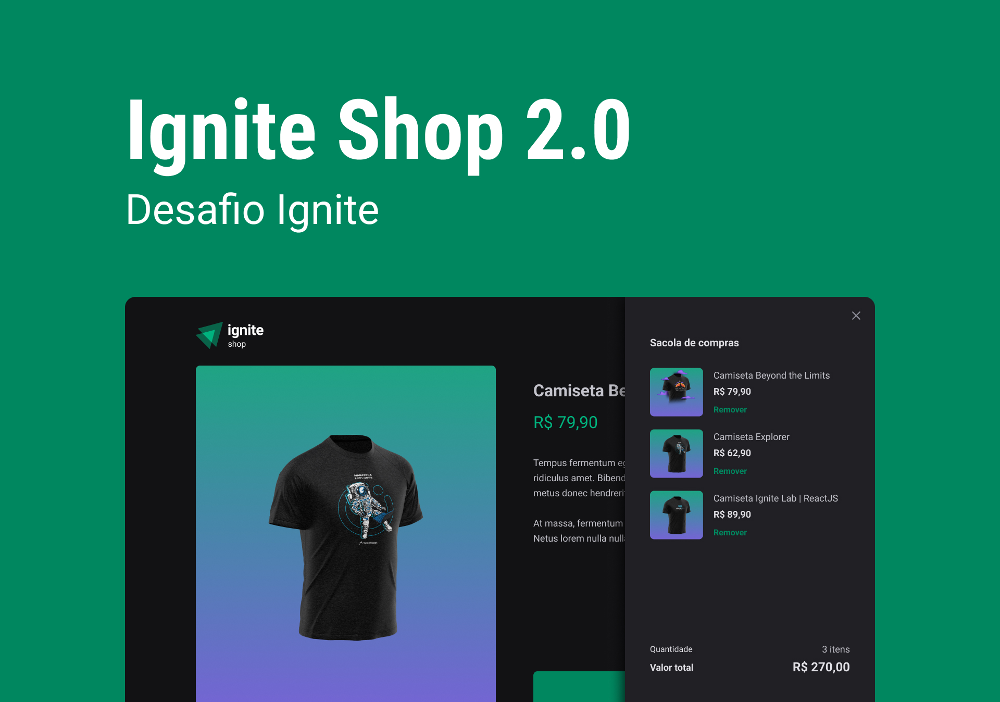

<h1 align="center"> IGNITE SHOP </h1>

Uma e-commerce de camisetas integrado com o stripe!
 
Saiba mais acessando os links abaixo...

  <a href="#-tecnologias">Tecnologias</a>&nbsp;&nbsp;&nbsp;|&nbsp;&nbsp;&nbsp;
  <a href="#-layout">Layout</a>&nbsp;&nbsp;&nbsp;|&nbsp;&nbsp;&nbsp;
  <a href="#memo-licença">Licença</a>

  

 

  

## 🚀 Tecnologias

Esse projeto foi desenvolvido com as seguintes tecnologias:

- Next.js
- Stitches
- Radix
- Stripe
- Axios
- Typescript

## 💻 Projeto

Em suma continuamos o desenvolvimento deste projeto que se iniciou no Ignite, agora adicionamos algumas funcionalidades nesta aplicação como um desafio!

## 🔖 Layout

Você pode visualizar o layout do projeto através [DESSE LINK](https://www.figma.com/file/FxlDRKOmznBbTH8DsTgnZU/Ignite-Shop-2.0/duplicate). É necessário ter conta no [Figma](https://figma.com) para acessá-lo.

## :memo: Licença

Esse projeto está sob a licença MIT.

---

Feito com 💙 by [Salinas](https://www.instagram.com/_eosalinas)
